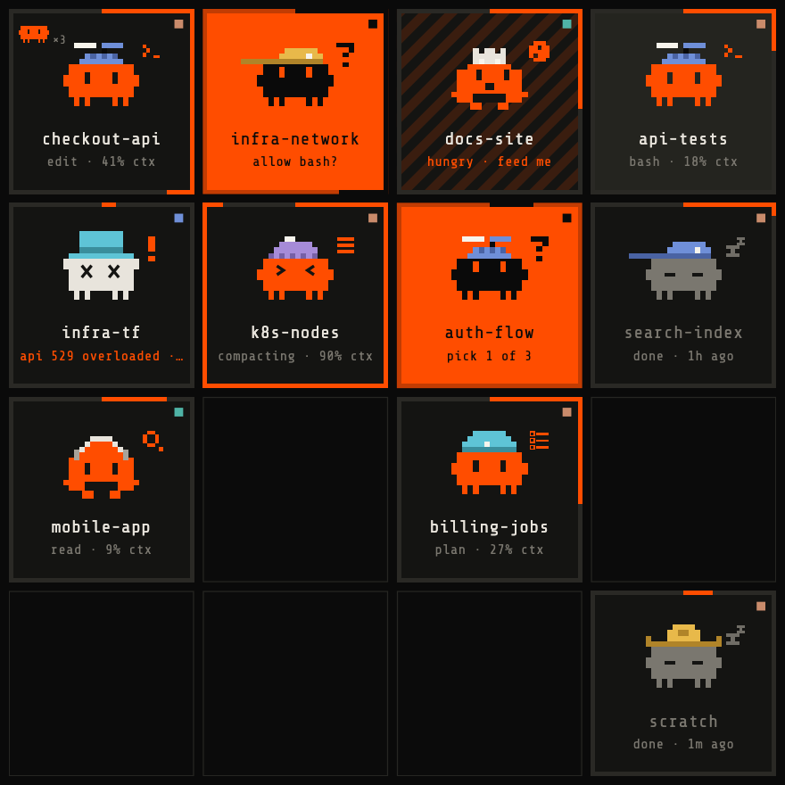
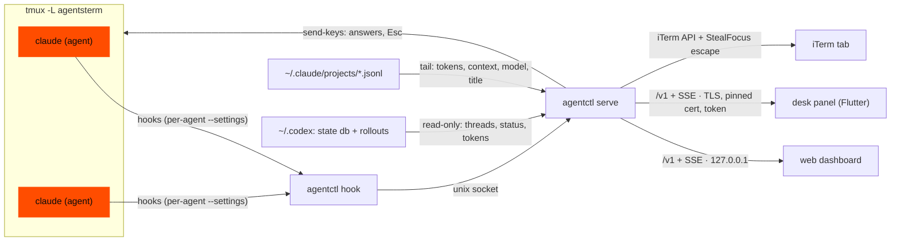

<p align="center"></p>

<p align="center">
  <a href="https://github.com/brushknight/agents-deck/actions/workflows/ci.yml"></a>
  <a href="https://github.com/brushknight/agents-deck/releases/latest"></a>
  
</p>

# agents deck

**Mission control for your Claude Code and Codex agents**: in your menu bar, on your desk, in the browser and in your terminal.

It's self-contained on your laptop: a small Go daemon tracks every agent (who's working, who needs you, what each one is doing, its context and cost), a deck drops down from the menu bar, and a web dashboard works on your phone too. Answer permission prompts and questions from any of them, or jump straight to the agent's iTerm tab. A 4″ desk panel is an optional companion, with more devices to come.

Claude Code agents run in private tmux sessions started with `agentctl new`. Your **Codex** threads join the same board automatically, read-only, with no wrapper or login.

## Where it shows up

| | |
|---|---|
|  |  |
| **Menu bar.** Click the critter and the deck drops down; it turns orange when an agent needs you. | **Browser and phone.** The same board, a panel view, and every agent's card. |
|  |  |
| **Desk panel.** A 4″ touch panel on Wi-Fi, as a companion. | **Terminal.** `agentctl` starts, lists, resumes and restores agents. |

Each critter shows what its agent is doing: thinking, reading, editing, running commands, compacting, waiting for you, or hungry for review once it's done. The full tour is in [docs/features.md](docs/features.md).

## Quick start

Requirements: macOS on Apple Silicon, tmux, Claude Code, and iTerm2 (for tab focus). The Codex app is optional.

```bash
curl -fsSL https://raw.githubusercontent.com/brushknight/agents-deck/main/install.sh | sh -s -- --app
```

It downloads the latest release, checks it against the release's `SHA256SUMS`, installs `agentctl` to `~/.local/bin`, starts the daemon at login and puts the menu bar app in `~/Applications` (drop `--app` to skip it). Then:

```bash
source <(agentctl completion zsh) # tab completion (add to ~/.zshrc)
cd ~/dev/my-project
agentctl new                      # a Claude agent for this folder (ctrl-q detaches)
agentctl web                      # the dashboard (one-time login link)
```

From source: `cd backend && go build -o ~/.local/bin/agentctl ./cmd/agentctl && agentctl install` (Go 1.24+), and `cd clients/macos && flutter build macos --release` for the menu bar app (Flutter 3.44). Want a full board without spending tokens? `agentctl sim start --root ~/dev --slots 12`.

## Commands

```text
agentctl new [dir] [-t title] [-c claude|codex|gemini|shell] [-d]   start an agent and attach (-d: stay detached)
agentctl attach <id|title>          show an agent in this terminal (ctrl-q detaches)
agentctl reopen                     iTerm tabs for every agent no terminal shows (after iTerm quits or crashes)
agentctl restore                    bring back agents lost with the tmux server (crash, reboot), each in its old spot
agentctl set restore ask|auto       keep lost agents for `restore` (default), or bring them back right away
agentctl ls                         the fleet at a glance
agentctl rm <id|title>              stop and forget an agent
agentctl move <id|title> <n>        put an agent at position n (free spots are fine)
agentctl sessions [words]           look up any Claude session by id, title, folder, branch or last prompt
agentctl resume <id-prefix>         continue a Claude session as an agent
agentctl web                        open the dashboard
agentctl set web lan|local          also serve the dashboard on your local network (:7342)
agentctl web --phone                one-time login link for your phone (valid 5 minutes)
agentctl pair [--rotate]            values for pairing the panel
agentctl set term iterm|tmux|window how "focus" shows an agent
agentctl set mouse tmux|native      who owns the mouse in agent terminals
agentctl sim start|stop             simulated agents for demos
```

## How it works




Each agent gets its own hook settings, so your global `~/.claude/settings.json` is never touched. Hooks report prompts, tool calls, permission requests, compaction and stops; Claude's transcripts give tokens, context, model and title; dialogs without a hook are read off the screen. Answers are typed into the agent's tmux session. The web UI, the menu bar app and the panel all speak one small JSON API ([docs/protocol.md](docs/protocol.md)).

## Security & privacy

- **Nothing leaves your machine:** no telemetry, no update checks, no third-party Go dependencies.
- **The web dashboard is loopback-only,** behind a one-time login link, a strict CSP and host and origin checks. `agentctl set web lan` opts into serving it to your phone over your local network.
- **The panel and the menu bar app** connect over TLS with a pinned certificate and a 256-bit token.
- **Codex files are only read.** App control is a single Apple event (asking iTerm for its API cookie): no synthetic keystrokes, no screen reading.
- **Secrets** live in `~/.local/share/agents-terminal/` (`0700` / `0600`).

## Docs

[Features](docs/features.md) · [Protocol](docs/protocol.md) · [Releasing](docs/releasing.md) · [Roadmap](docs/roadmap.md)

| path | |
|---|---|
| `backend/` | Go daemon and CLI (`agentctl`), with the web UI embedded. `go test -race ./...` |
| `clients/flutter/agents_ui` | The deck UI as a Flutter package, shared by the desk panel and the menu bar app. |
| `clients/macos` | The menu bar app (Flutter + a small Swift shell). |
| `docs/fixtures/state.json` | The sample fleet behind demo mode, the web fixture view and the tests. |
