<p align="center">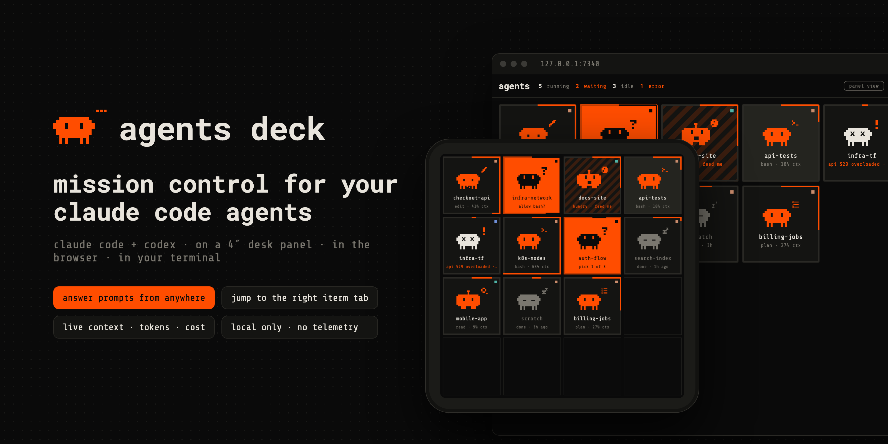</p>

# agents deck

**Mission control for a fleet of Claude Code agents**, plus your Codex sessions, on a 4″ desk panel, in the browser and in your terminal.

You start agents with `agentctl new`. Each one runs in a private tmux session, and a small Go daemon keeps track of all of them: who's working, who needs you, what each one is doing, how full its context is and what it has cost so far. The board shows that live. When an agent asks for permission or asks you a question, you can answer from the panel or the web without going back to the terminal. **focus terminal** takes you to that agent's iTerm tab, even inside a hidden hotkey window.

The daemon only talks to your own Mac and your own panel. It has no telemetry and no third-party Go dependencies.

---

## What you see

| | |
|---|---|
| 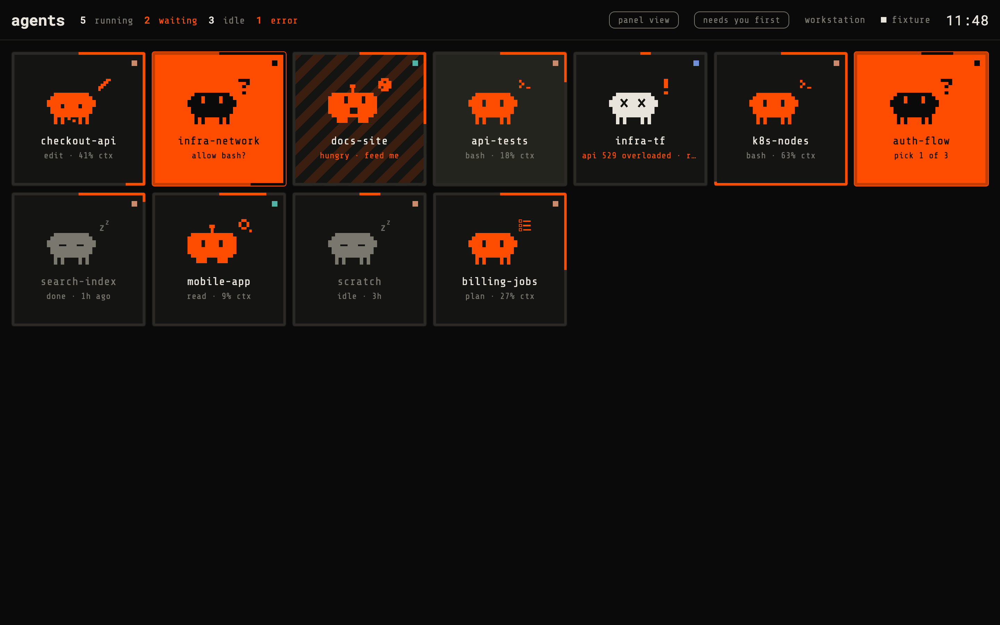 | 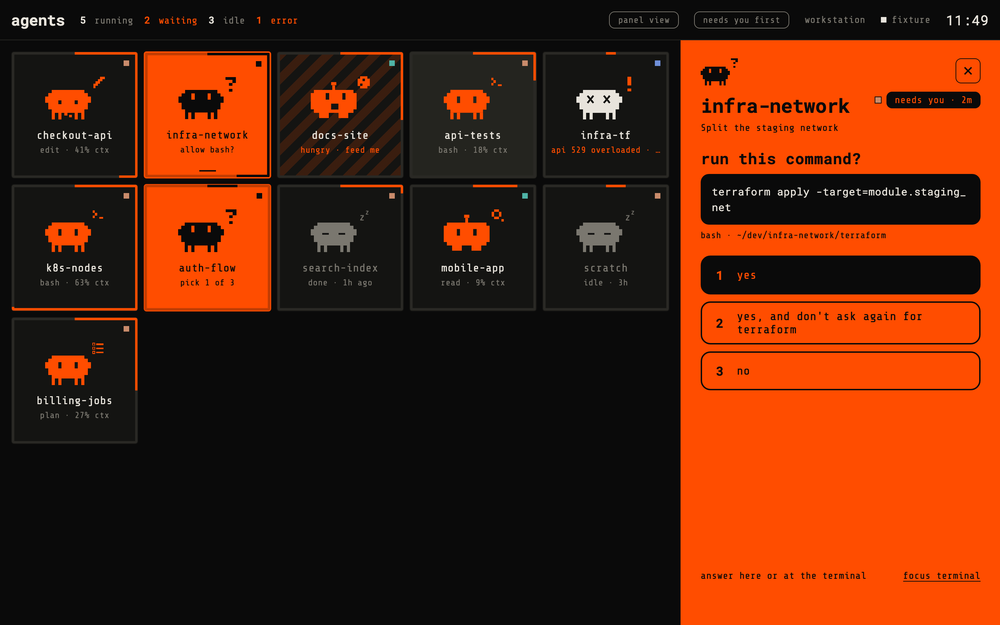 |
| **The board.** One tile per agent. The pixel critter shows what the agent is doing (thinking, reading, editing, running a command, planning…). The tile's border fills clockwise with its context window. Orange means it's working; a solid orange tile means it needs you. An agent that has finished but whose result you haven't reviewed yet gets hungry: sliding orange stripes and a critter chomping at a cookie, until you focus its terminal or give it a new task. | **Answer from anywhere.** Permission prompts show the exact command with Claude's own options. Questions show their choices. Your answer is typed into the agent's terminal, and a prompt that has already changed is refused. |
| 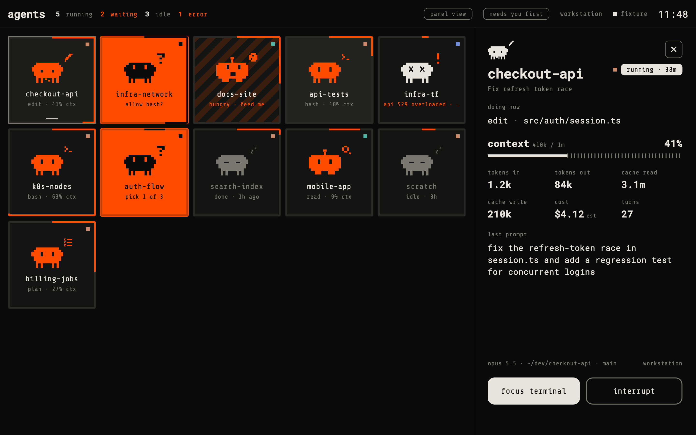 | 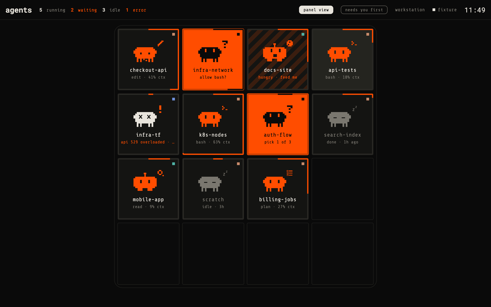 |
| **Agent detail.** Shows what it's doing now, context used, tokens, estimated cost, turns and the last prompt, plus **focus terminal**, **interrupt** and **stop**. | **Panel view.** The web dashboard can mirror the 720×720 desk panel. Drag a tile onto another to swap them; the order is shared with the panel. |

### On the desk panel

A 4-inch 720×720 touch panel (Raspberry Pi CM4, Flutter) talks to the daemon over Wi-Fi. The connection is TLS with a pinned certificate.

| | | |
|---|---|---|
| 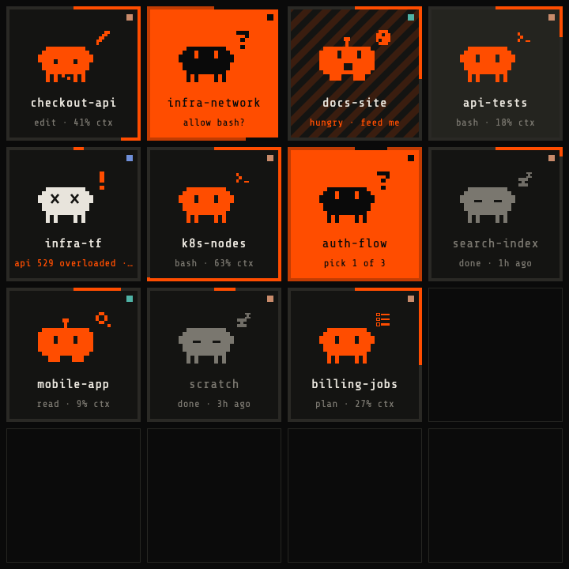 | 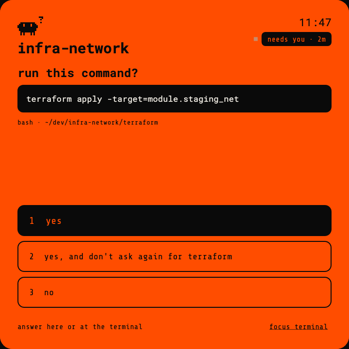 | 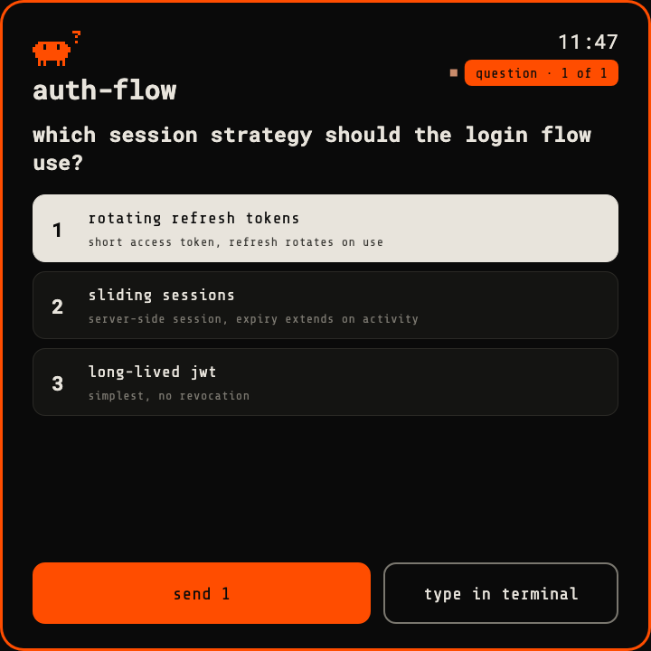 |

<p align="center">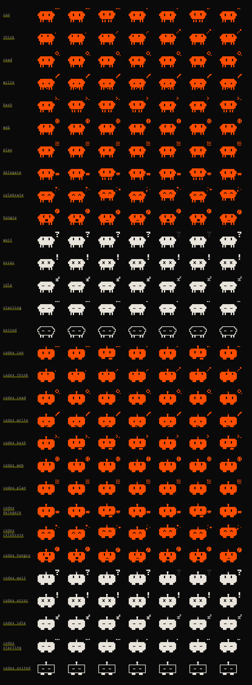<br><sub>Critter poses: one for each kind of work, plus waiting, error, idle, starting and exited.</sub></p>

### In the terminal

<p align="center">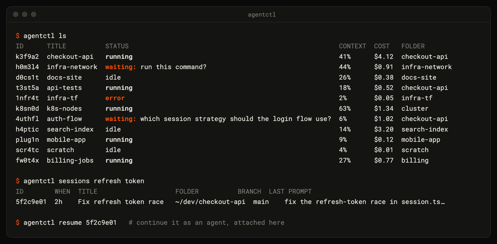</p>

---

### Codex sessions too

Threads from the **Codex app** (and Codex CLI) that were active in the last 6 hours appear on the board automatically. They're drawn by their own mascot: a boxy bot with an antenna and block feet. No wrapper, no login and no config change is needed. agents deck reads Codex's local files read-only:
- **Names, folder, branch and model** come from `~/.codex/state_*.sqlite`, opened with the system `sqlite3 -readonly`.
- **Live status** comes from each thread's `~/.codex/sessions/…/rollout-*.jsonl`: running or idle, what it's doing, context window, tokens, a question waiting for you, and hungry when a turn finishes.

**focus** opens the thread in the Codex app (`codex://threads/<id>`). Answering, interrupting and stopping stay in the Codex app. **hide** removes a thread from the board until it's active again. Settings in `config.json`: `"codex": false` turns it off, and `"codexWindowHours": 12` widens the window.

## Quick start

Requirements: macOS, Go 1.24+, tmux, Claude Code, and iTerm2 (only needed for tab focus).

```bash
git clone git@github.com:brushknight/agents-deck.git && cd agents-deck/backend
go build -o ~/.local/bin/agentctl ./cmd/agentctl
agentctl install                  # LaunchAgent: the daemon starts at login
source <(agentctl completion zsh) # tab completion (add to ~/.zshrc)

cd ~/dev/my-project
agentctl new                      # a Claude agent for this folder, attached here (ctrl-q detaches)
agentctl web                      # open the dashboard (one-time login link)
```

Want a full board without spending tokens? Run `agentctl sim start --root ~/dev --slots 12`. It starts simulated agents that "work" on the real projects under `~/dev`: they read, edit, run commands, ask questions and hit errors. They're read-only: they list file names and never open, change or run anything. `agentctl sim stop` removes them.

## Commands

```text
agentctl new [dir] [-t title] [-c claude|codex|gemini|shell] [-d]   start an agent and attach (-d: stay detached)
agentctl attach <id|title>          show an agent in this terminal (ctrl-q detaches)
agentctl ls                         the fleet at a glance
agentctl rm <id|title>              stop and forget an agent
agentctl move <id|title> <n>        put an agent at position n
agentctl sessions [words]           look up any Claude session by id, title, folder, branch or last prompt
agentctl resume <id-prefix>         continue a Claude session as an agent
agentctl web                        open the dashboard
agentctl pair [--rotate]            values for pairing the panel
agentctl set term iterm|tmux|window how "focus" shows an agent
agentctl sim start|stop             simulated agents for demos
```

## How it works

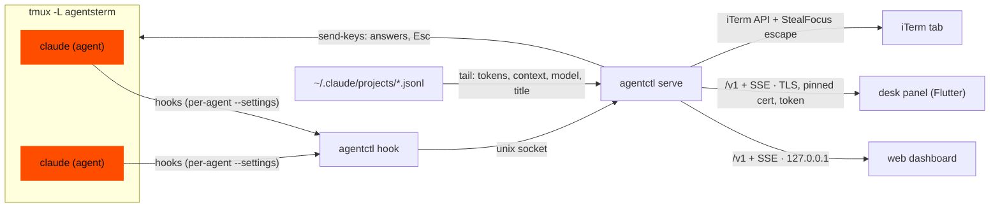

- **Status.** Each agent is started with its own hook settings file, so your global `~/.claude/settings.json` is never touched. Hooks report prompts, tool calls, permission requests and stops. Dialogs that don't fire a hook, such as workspace trust, are read off the screen.
- **Usage.** Token counts, model, branch and Claude's session title come from Claude's transcript files. Cost is estimated from public list prices.
- **Answers.** The chosen key is sent into the agent's tmux session. Arrow-key menus get Up/Down + Enter.
- **Focus.** iTerm's local API selects the agent's tab and pane. Then iTerm's `StealFocus` escape code, written to that pane's terminal, brings the window forward, including a hidden hotkey window. The alternatives are `agentctl set term tmux` (switch your last-used tab to the agent) and `window` (only raise the window).
- **Protocol.** One small JSON API that sends the whole state on every change. See [docs/protocol.md](docs/protocol.md).

## Security & privacy

- **Nothing leaves your machine.** No telemetry, no update checks, standard library only.
- **The web dashboard is loopback-only:**
  - it only answers requests for its own host name, which blocks DNS-rebinding attacks;
  - the login is a one-time link that sets an HttpOnly, SameSite=Strict cookie;
  - every POST has its Origin checked;
  - strict CSP (`default-src 'none'`), and no external fonts or scripts.
- **The panel connection uses TLS 1.2+:**
  - the panel trusts the server's self-signed certificate only by its pinned fingerprint;
  - requests need a 256-bit bearer token (`agentctl pair --rotate` replaces it);
  - that port serves the API only.
- **App control is limited** to one Apple event: asking iTerm for its API cookie. There are no synthetic keystrokes and no screen reading.
- **Secrets** live in `~/.local/share/agents-terminal/` (folder `0700`, files `0600`).

## Repository

| path | |
|---|---|
| `backend/` | Go daemon and CLI (`agentctl`). The web UI is embedded from `backend/internal/web/static`. |
| `docs/protocol.md` | The `/v1` API spoken by the web UI and the panel. |
| `docs/fixtures/state.json` | Sample fleet used by demo mode (`agentctl serve --demo`), the web fixture view and the panel tests. |

The desk panel client is a separate Flutter app; it speaks the same `/v1` protocol (see [docs/protocol.md](docs/protocol.md)).

```bash
cd backend && go test -race ./...
```
