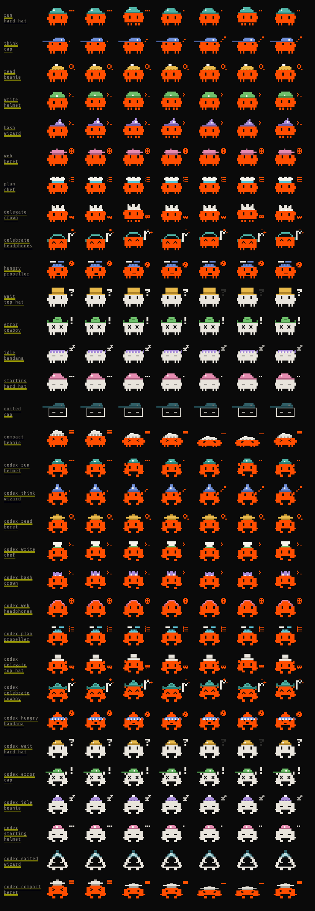
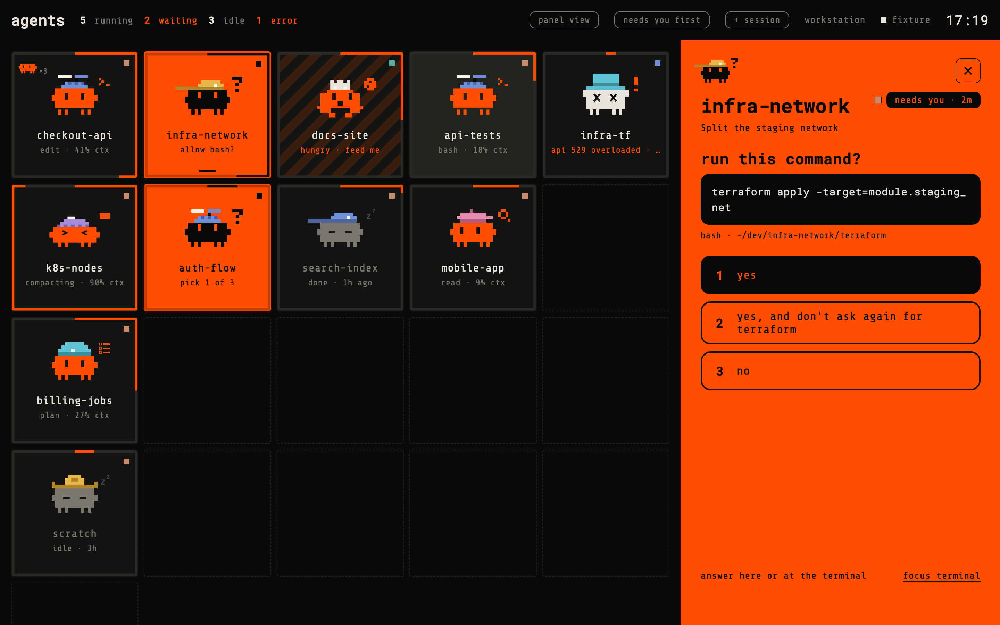

# Features

Everything the deck shows and does, in one place. The [README](../README.md) is the short version.

## The board

One tile per agent, on a 4×4 deck: the same board in the menu bar, on the desk panel and in the browser's panel view.

- **The critter** is Claude's pixel mascot (Codex threads get an onigiri) and shows what the agent is doing: thinking, reading, editing, running a command, searching the web, planning, delegating to subagents. A finished turn waves a checkered flag; an error throws both arms up; while Claude compacts the conversation it gets squeezed flat and springs back.
- **Hats.** Every agent wears a pixel hat picked by its working folder, so agents of one project look alike at a glance: 13 shapes (hard hat, cap, beanie, helmet, wizard, beret, chef, crown, headphones, propeller, top hat, cowboy, bandana) in 8 colours, chosen by a stable hash of the folder. Tap the critter on an agent's card (or click it in the web dashboard) to pick another shape or colour for that folder, or go back to automatic. From the terminal: `agentctl hats`, `agentctl set hat <agent|folder> <shape> [colour]`, `agentctl set hat <agent|folder> auto`. The hats were inspired by the hatted pixel Claudes in [“9 NEW Claude Mods that can truly change how you work”](https://www.youtube.com/watch?v=lDrAZ1wAyVs) by Jay E (RoboNuggets).
- **Colour.** Orange means working; a solid orange tile means the agent needs you (a permission prompt or a question).
- **The border** fills clockwise with the agent's context window.
- **Hungry.** An agent that finished but whose result you haven't reviewed gets sliding orange stripes and a critter chomping at a cookie, until you focus its terminal or give it a new task.
- **Subagents.** A small critter in the tile's top-left corner means subagents are at work too, with a count when there are several. The agent's card shows each one, posed by what it's doing.
- **Pages.** The deck holds 16 agents per page (page = slot ÷ 16). With more, the tiles get a little shorter (they keep their width) and a row of bars appears under the grid, in the same square: the current page bright, another page orange when an agent there needs you. Swipe left and right (touch or trackpad), use ← / →, or tap a bar.
- **Arranging.** Drag a tile onto any free spot to move it there, or onto another tile to swap them (long-press on touch screens). The layout is shared by every view. `agentctl move <agent> <n>` does the same from the terminal.

 Every pose, for the Claude critter and the Codex onigiri.

## Agent cards

Tap a tile for its card:

- **Overview.** What it's doing now, context used, tokens, estimated cost, turns and the last prompt, with **focus terminal**, **interrupt** and **stop** (or **resume** / **remove** once it has exited).
- **Permission prompts** show the exact command with Claude's own options; **questions** show their choices. Your answer is typed into the agent's terminal, and a prompt that has already changed is refused.
- **Free-text input** can't be typed on the deck: the card sends you to the terminal.

## Where it shows up

| | |
|---|---|
| **Menu bar** | A critter icon that turns orange when an agent needs you; the deck drops down in the top-right corner. Esc, the ‹ button or a click elsewhere hides it; right-click opens the web dashboard. |
| **Browser** | `agentctl web` opens the dashboard with a one-time login link. It has a grid view and a panel view that mirrors the 720×720 desk panel. |
| **Phone** | `agentctl set web lan` also serves the dashboard on your local network (port 7342); `agentctl web --phone` prints a 5-minute login link. On a phone it opens in the deck view; the panel view toggle switches to a list of agent rows. |
| **Desk panel** | A 4″ 720×720 touch panel (Raspberry Pi CM4, Flutter) talking to the daemon over Wi-Fi, TLS with a pinned certificate. Cards close with an edge swipe. |
| **ESP32 board** | A 1.47″ 320×172 screen without touch (Waveshare ESP32-S3-LCD-1.47B) on the same Wi-Fi, TLS and pinned certificate. Read-only: one agent in detail and a mini-board of the fleet, with the same mascots and hats. See [panel-esp32](../panel-esp32/README.md). |
| **Terminal** | `agentctl ls`, `sessions`, `resume`… Agent terminals are tmux sessions you attach to with `agentctl attach`, or jump to with **focus terminal**. |

## Codex sessions

Threads from the Codex app (and Codex CLI) active in the last 6 hours appear on the board automatically, drawn as an onigiri, with no wrapper and no login. agents deck reads Codex's local files read-only: names, folder, branch and model from `~/.codex/state_*.sqlite` (opened with `sqlite3 -readonly`), live status from the end of each thread's `rollout-*.jsonl`.

| | Claude Code agents | Codex threads |
|---|---|---|
| started by | `agentctl new` / `resume` | the Codex app, as usual |
| status, activity, context, tokens | yes | yes |
| cost estimate | yes | — (Codex reports no prices) |
| answer prompts from the deck | yes | no, answer in the Codex app |
| focus | the agent's iTerm tab | opens the thread in the Codex app |
| interrupt / stop | yes | no |
| remove from the board | **stop** | **hide**, until the thread is active again |

`config.json`: `"codex": false` turns it off; `"codexWindowHours": 12` widens the window.

## Claude sessions started elsewhere

Claude Code sessions you start by hand in any terminal (plain `claude`) can join the deck too. Tap a free cell (or **+ session** on the web dashboard, or `agentctl live` / `agentctl add <session>`) to see them and add one; it lands in that cell.

The list comes from Claude Code itself (`claude agents --json`), so it covers every active session on the Mac: ones in your terminals and **background** sessions (`claude --bg`, and the ones the Claude desktop app runs). Older Claude Code versions fall back to scanning for `claude` processes in terminals.

Added sessions are **watched**: status (working, idle, hungry when a turn finishes while watched), activity, context, cost and subagents come from the session's transcript, and **focus** jumps to its terminal tab. Claude Code reports when one is blocked on you, so the tile turns "needs you"; answer it in that session (the deck can't type into it). Focus on a background session opens it in a new iTerm tab with `claude attach`. **remove from deck** takes the session off the deck; the session itself keeps running. Added sessions come back whenever they run again.

## Agent terminals

- **Focus.** iTerm's local API selects the agent's tab and pane, then iTerm's `StealFocus` escape brings the window forward, including a hidden hotkey window. `agentctl set term tmux` switches your last-used tab to the agent instead; `window` only raises its window.
- **Mouse.** tmux mouse mode is on, so the wheel scrolls the agent's history. A drag selection stays highlighted and goes to the clipboard; double-click selects a word, path or URL, triple-click a line; typing afterwards goes to the agent. A click on a link opens it (http, https and file links only). `agentctl set mouse native` hands the mouse to iTerm instead.
- **Tab names** follow the name Claude Code gives the session.
- **After an iTerm crash** the agents keep running in tmux; `agentctl reopen` opens a tab for each one again.

## Restore after a tmux crash or reboot

If the tmux server dies under live agents (a crash, a reboot), they are marked **lost with tmux** and stay on the board. `agentctl restore` (or **restore all** on the web dashboard) brings them back: Claude agents resume their own conversation, other tools start fresh in their folder, each in its old spot. `agentctl set restore auto` does it as soon as the loss is noticed.

## Simulated agents

`agentctl sim start --root ~/dev --slots 12` fills the board with simulated agents that "work" on the real projects under `~/dev`: they read, edit, run commands, ask questions, hit errors and sometimes compact. They're read-only (they list file names and never open, change or run anything). `agentctl sim stop` removes them.

## Settings

`agentctl get` lists them; `agentctl set <key> <value>` changes them.

| key | values |
|---|---|
| `term` | `iterm` (default), `tmux`, `window`: how focus shows an agent |
| `mouse` | `tmux` (default), `native`: who owns the mouse in agent terminals |
| `restore` | `ask` (default), `auto`: what happens to agents lost with tmux |
| `web` | `local` (default), `lan`: also serve the dashboard on your local network |
| `hat` | `agentctl set hat <agent|folder> <shape> [colour]`, `none` or `auto`: the hat of a working folder (stored in `config.json` `"hats"`) |
