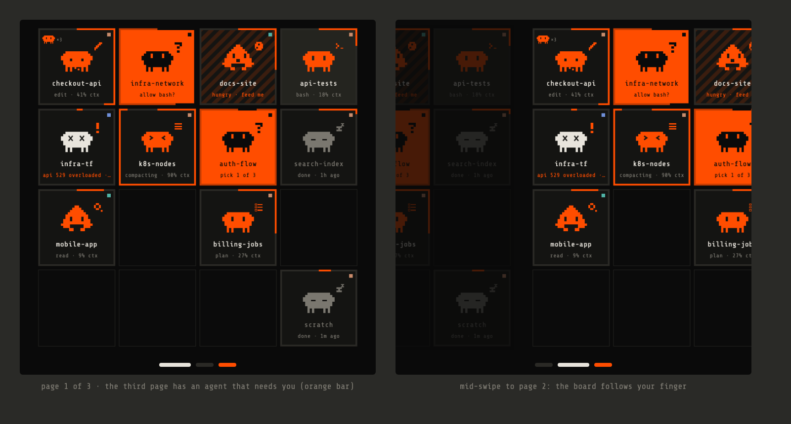

# Roadmap

Short and ordered. Each step should be usable on its own before the next starts.

## 1. Restore after a tmux crash or reboot — done

`agentctl restore`, `agentctl set restore ask|auto`, `POST /v1/restore`, and a "restore all" bar on the web dashboard. Shells and other tools are relaunched fresh in their folders; simulated agents are dropped.

Before this, a dead tmux server (crash, reboot, `tmux kill-server`) left every agent `exited`; each one offered **resume**, then moved to the history after 10 minutes.

- `agentctl restore` brings the whole board back in one go. Every Claude agent that has a session id is resumed with `claude --resume <id>` in its own folder, keeping its title (if you set one with `-t`) and its board position.
- On daemon start, agents that were alive before the tmux server died are listed for restore instead of expiring. Restoring automatically is a setting (`agentctl set restore auto|ask`), default `ask`.
- Shells and non-Claude agents come back as fresh sessions in their folders.
- Out of scope: running processes themselves never survive; only the conversations do.

## 2. Menu bar app (the deck as an overlay) — in progress

Working: the deck UI moved into a shared Flutter package (`clients/flutter/agents_ui`, used by the desk panel too); `clients/macos` is the menu bar app (no Dock icon, a critter icon that turns orange when an agent needs you, the deck dropping down under it, Esc or a click elsewhere hides it, local pairing). Left: a global shortcut, release builds (they need Flutter's AOT compiler, which this Mac's security policy blocks, so they move to CI in step 4) and a universal arm64 + Intel binary.

A macOS menu bar icon. Clicking it opens a small overlay in the top-right corner with the same 4×4 deck as the desk panel. Click an agent for its card: answer, focus terminal, interrupt.

- Reuse the panel UI as-is: the agents app from the Flutter panel, built for macOS desktop. That gives the same tiles, critters, cards and drag-to-arrange, with no second UI to maintain.
- It talks to the daemon locally. Pairing is automatic: it reads the token and certificate fingerprint from `~/.local/share/agents-terminal`.
- The icon shows state at a glance: plain when idle, an accent dot when an agent needs you.
- It hides when it loses focus (like other menu bar popovers), and has a global shortcut to open it.

Decided: Flutter desktop, reusing the panel UI through the shared package.

## 3. Notifications (opt-in)

Off by default. `agentctl set notify off|needs-you|all`:

- `needs-you`: a permission prompt or a question is waiting.
- `all`: also when an agent finishes a turn (turns hungry).

Delivered by the menu bar app as native notifications. Clicking one opens that agent's card. No sound unless asked for.

## 4. Easy install: build and release pipeline — in place, first release pending

`ci` (tests on every push) and `release` (on a tag: builds, optional signing and notarization, GitHub release with `SHA256SUMS`) workflows, and `install.sh`. macOS arm64 only for now; see [releasing.md](releasing.md) for signing secrets and the platform plan.

- GitHub Actions: `go test -race` and the web checks on every push; a release builds on every tag.
- Release artifacts:
  - a universal macOS `agentctl` (arm64 + amd64) with the version stamped in;
  - the menu bar app;
  - checksums.
- An install script: download, verify the checksum, put `agentctl` in `~/.local/bin`, run `agentctl install`.
- Code signing: today's ad-hoc signature makes macOS re-ask for permissions after every build. Releases should be signed with a stable identity (a Developer ID with notarization, or at least one consistent certificate).

## Next (after the first release)

### Every Claude Code session on this machine

See the Claude sessions that agentctl didn't start (plain `claude` in any terminal) and add the ones you want to the deck.

- Discovery: running `claude` processes, matched to their session transcript by folder and recency. No second process on the session, so nothing gets forked.
- Watch-only tiles until adopted: status, activity, context, cost and subagents from the transcript; the "needs you" state from what the transcript and terminal title show (no hooks there).
- Focus: find the session's terminal by its TTY (the iTerm API already maps TTYs to tabs).
- Adding to the deck is a choice per session (a picker on the web dashboard and in the menu bar app); the rest stay listed but off the board.

### Claude desktop app sessions

The Claude desktop app's sessions, some of them important. Pick which ones show on the deck, read-only like Codex threads: status and activity, focus opens them in the app. First step: find out what the app keeps locally and whether it can be read without touching it.

### More than 16 agents: a paged deck

With every slot taken, the deck pages left and right instead of the pager tile:

- Tiles a little smaller so a row of page bars fits under the 4×4 grid: one rounded bar per page, the current one wider and bright, an orange bar where an agent on that page needs you.
- Swipe left and right on the panel (the board follows your finger), trackpad swipes, arrow keys and clicks on the bars in the menu bar app and the browser.
- Slots keep their meaning: page = slot / 16, so an arranged board stays arranged.

## Later

- **Homebrew:** a tap with a formula for `agentctl` and a cask for the menu bar app, once the above has been used for a while.

## Parked ideas

From reviewing other tools (e.g. herdr). Not planned, but kept in mind:

- Screen-reading status for agents without hooks (Codex CLI, Gemini…), and as a safety net for Claude states hooks miss.
- Agent automation: `agentctl prompt --wait`, `agentctl wait --until blocked`, `agentctl read`, plus a skill file.
- `agentctl explain <agent>`: why the deck shows an agent's current state.
- Grouping agents by project on the board.
