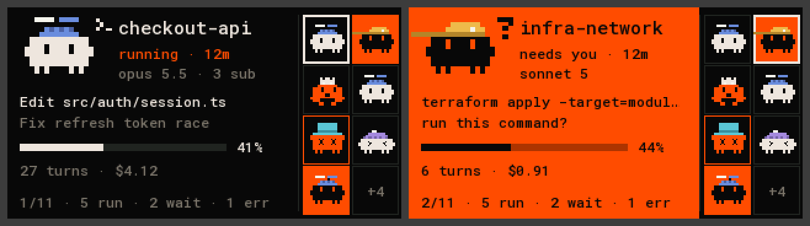

# agents deck on an ESP32-S3 board

A small desk panel for agents deck: firmware for the
[Waveshare ESP32-S3-LCD-1.47B](https://www.waveshare.com/wiki/ESP32-S3-LCD-1.47B)
(ST7789, 320×172, no touch, one button, one RGB LED). The board connects to
the `agentctl` daemon over Wi-Fi and shows the fleet.



The board is a pure client and it is **read-only**. It speaks the same `/v1`
protocol as the big panel, with the same pinned certificate and token, opens
the event stream and sends nothing else. Everything it draws comes from the
daemon: which agents, their status and activity, their hats. It cannot answer
a prompt, focus a terminal or stop an agent.

## What the screen shows

- **Left, the hero**: one agent with its sprite and pose, name, status and
  age, model, what it is doing, context bar, turns and cost. The footer shows
  its position and how many agents run, wait or failed.
- **Right, the mini-board**: up to 8 agents in slot order. A solid orange cell
  is an agent that waits for you. The white frame marks the hero.
- The board picks the hero itself: waiting → error → finished but not reviewed
  ("hungry") → running → the rest. Equal rank: the most recent change wins.
- **BOOT button**: a short press shows the next agent and holds it for 30 s.
  A small square in the footer marks the hold. A new waiting agent ends it.
- **LED**: orange flashes when an agent waits or failed, a slow blue breath
  while agents run, off otherwise.
- **Backlight**: dim when every agent is idle.
- Full-screen messages: `no Wi-Fi`, `looking for the Mac`, `connecting`,
  `pairing error`, `no agents`. If the link drops, the last fleet stays on
  screen with `link lost` in the footer.

The mascots are ported from the web UI: Claude's block with arms, the Codex
onigiri, every pose, and the pixel hat of each working folder (13 shapes,
8 colours, sent by the daemon). Text is Roboto Mono with Latin and Cyrillic.

## Build and flash

Requirements: [PlatformIO](https://platformio.org/) and Python 3.10+ with
`pyserial` and `pillow` (for the tools), the daemon installed on the Mac
(`agentctl install`), and the board on the same Wi-Fi network.

```bash
cd panel-esp32
python3 -m venv .venv && .venv/bin/pip install platformio pyserial pillow
.venv/bin/python tools/make_config.py --ssid "my-network"
.venv/bin/pio run -t upload
```

`make_config.py` reads `agentctl pair` and writes `include/config.h`: the
daemon's host, port, token and certificate fingerprint, and the Wi-Fi name
and password (asked for without echo). The file is mode 600 and is not in
git. Everything except the pairing is kept on a re-run, so after `agentctl
pair --rotate` this is enough:

```bash
.venv/bin/python tools/make_config.py && .venv/bin/pio run -t upload
```

Other options: `--host` (an address instead of the mDNS name), `--hostname`
(the board's own name), `--wifi-from HEADER` (copy `WIFI_SSID` / `WIFI_PASS`
from another firmware's header), `--wifi-nvs NAMESPACE` (use the `ssid` and
`pass` keys a previous firmware left in the board's NVS).

## Sessions started outside agentctl

The board shows what the daemon has on its deck, nothing else. A Claude
session started by hand, in the background or in the desktop app gets there
through the daemon: `agentctl live` lists them and `agentctl add <session>`
puts one on the deck. The board then draws it like any other agent.

## Look at the board from the Mac

```bash
.venv/bin/python tools/capture.py --status
.venv/bin/python tools/capture.py out/board.png --scale 2
```

`--status` prints the firmware's state (link, agent count, free heap). The
PNG is the board's real framebuffer, read over USB serial.

Open the serial port the way `tools/capture.py` does. This chip resets when
RTS is high while DTR is low, and a naive open passes through that state.

## Tests and the host renderer

```bash
.venv/bin/pio pkg install
tests/run.sh
clang++ -std=c++17 -Ilib/core -I.pio/libdeps/waveshare-s3-147b/ArduinoJson/src sim/render.cpp -o out/render
mkdir -p out/frames && out/render ../docs/fixtures/state.json out/frames 300
.venv/bin/python tools/ppm2png.py out/sheet.png out/frames/hero-*.ppm --cols 3
```

`lib/core` has no Arduino code, so the same parsing, hero choice and drawing
run on the Mac. `sim/render` draws every frame of a State JSON file without
the board. For a live fleet without real agents use `agentctl sim start`.

## Layout

| Path | What |
|---|---|
| `src/main.cpp` | Wi-Fi, mDNS, TLS with a pinned certificate, stream, display, LED, button, serial debug |
| `lib/core/sse.h` | finds each `data:` payload in the event stream |
| `lib/core/model.h` | `Fleet` and `parseState()` |
| `lib/core/view.h` | hero choice, button hold, poses, text lines |
| `lib/core/canvas.h`, `font_data.h` | RGB565 framebuffer, bitmap font |
| `lib/core/sprites.h` | the block, the onigiri, 16 poses and 13 hats |
| `lib/core/screen.h` | the frame layout |
| `tools/` | `make_config.py`, `capture.py`, `make_font.py`, `ppm2png.py` |

## Security

- The board checks the SHA-256 of the daemon's certificate before it sends
  the token. A wrong certificate gives `pairing error` and no request.
- The token is stored in the firmware image in plain text. Anyone who can
  read the board's flash can read it. Rotate it with `agentctl pair --rotate`.
- There is no server on the board. USB serial answers two read-only
  commands.

## Limits

- Landscape only. At most 16 agents in memory and 8 on the mini-board.
- Roboto Mono has no arrows or CJK. A missing glyph is drawn as `?`.
- While the daemon is unreachable the screen can stall for up to 2 s at a
  time: the mDNS lookup and the TLS handshake block.
- The request line is `GET /v1/events HTTP/1.0`, so the daemon streams
  without chunked encoding and the firmware needs no chunk decoder.

## Licences

The bitmap font in `lib/core/font_data.h` is rendered from Roboto Mono
(SIL Open Font License 1.1, `lib/core/OFL-robotomono.txt`).
